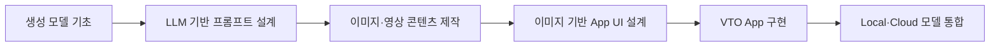
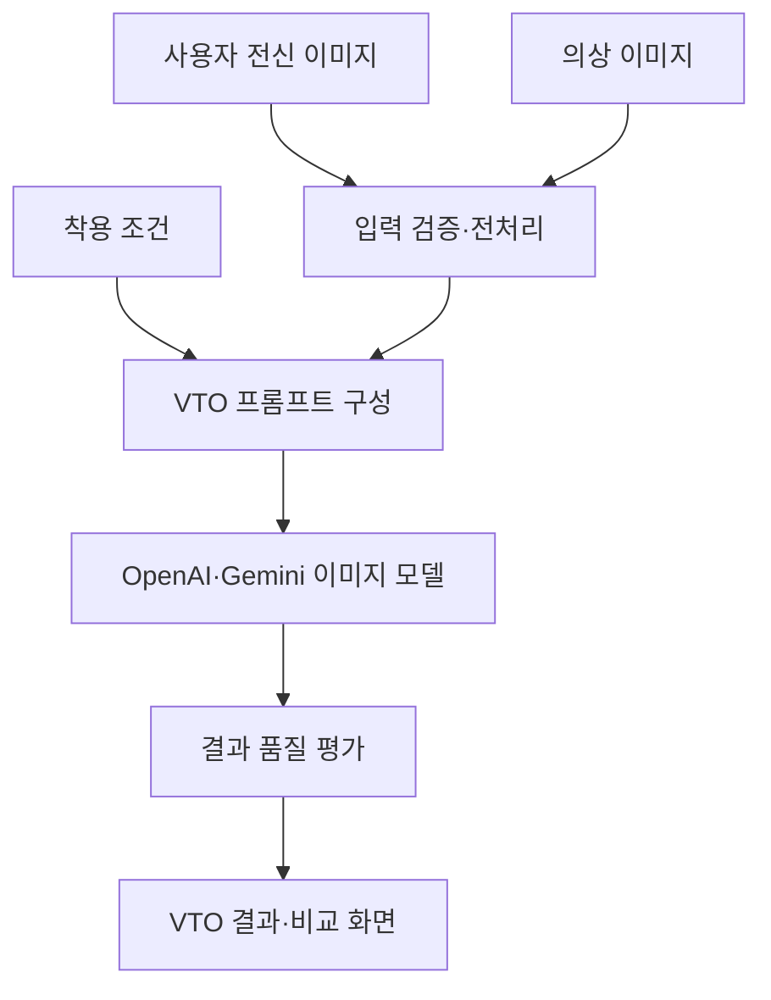

이 과정은 단순한 생성형 AI 도구 활용 교육이 아니라, 생성 모델의 기초 원리에서 시작해 멀티모달 콘텐츠 제작, UI 설계, VTO 애플리케이션 구현까지 연결하는 4일·32시간 프로젝트형 과정입니다.

강의의 전체 흐름은 다음과 같습니다.

## 1. 과정의 핵심 목표

수강생이 과정 종료 후 다음 역량을 확보하도록 설계하는 과정입니다.

* Autoencoder, VAE, Diffusion Model의 핵심 원리 이해
* Local LLM을 활용한 프롬프트 생성·개선 파이프라인 설계
* LLM-grounded Diffusion의 개념과 텍스트-이미지 정렬 방식 이해
* NotebookLM을 활용한 콘텐츠 분석, 스크립트 및 영상 기획
* 이미지·동영상 생성 API를 활용한 기능 구현
* 이미지 생성 모델을 활용한 App UI 기획 및 프로토타이핑
* OpenAI 및 Gemini 이미지 모델의 특성과 API 활용 방식 비교
* 의류 이미지와 사용자 이미지를 이용하는 VTO App의 구조 이해
* 생성형 AI 모델, 프런트엔드, 백엔드 API를 연결한 미니 프로젝트 완성

## 2. 4일간의 권장 구성

| 일차  | 핵심 주제                            | 주요 학습 내용                                                       | 실습 결과물                    |
| --- | -------------------------------- | -------------------------------------------------------------- | ------------------------- |
| 1일차 | 생성 모델과 LLM-grounded Diffusion 기초 | Autoencoder, VAE, Latent Space, Diffusion, Local LLM, 프롬프트 구조화 | Local LLM 기반 이미지 프롬프트 생성기 |
| 2일차 | 이미지·영상·동영상 콘텐츠 제작                | NotebookLM 기반 자료 분석, 스토리보드, 이미지 생성, 영상 생성 API                  | 주제 기반 숏폼 영상 또는 제품 소개 영상   |
| 3일차 | 이미지 모델을 활용한 App UI 개발            | 요구사항 분석, 화면 구조, UI 이미지 생성, 디자인 시스템, 프런트엔드 연결                   | 생성형 AI 기반 App UI 프로토타입    |
| 4일차 | OpenAI·Gemini 기반 VTO App         | VTO 원리, 이미지 전처리, 의상 합성, API 오케스트레이션, 결과 평가                     | VTO App 미니 프로젝트           |

## 3. 일차별 8시간 학습 방향

### 1일차: Autoencoder와 Diffusion Model 기초

이론과 간단한 코드 실습을 결합합니다.

* 생성형 AI 모델의 분류
* Autoencoder의 Encoder–Latent–Decoder 구조
* VAE의 확률적 잠재공간
* Pixel Space와 Latent Space의 차이
* Forward Diffusion과 Reverse Denoising
* U-Net, Noise Scheduler, Text Encoder
* Stable Diffusion 계열의 기본 구조
* LLM-guided Prompt와 LLM-grounded Diffusion의 차이
* Local LLM을 이용한 사용자 요구사항 구조화
* 장면, 객체, 위치, 속성, 카메라 정보를 포함한 프롬프트 생성
* Negative Prompt와 반복 개선 전략

핵심 실습은 다음 흐름으로 구성합니다.

`사용자 자연어 요구 → Local LLM 분석 → 구조화된 프롬프트 → Diffusion 모델 → 이미지 평가·개선`

### 2일차: NotebookLM 기반 이미지·영상 제작

NotebookLM을 콘텐츠 이해 및 기획 계층으로 사용하고, 실제 생성은 이미지·영상 모델과 API로 연결합니다.

* 문서, 웹 자료, 강의 자료를 소스로 구성
* 핵심 내용 요약 및 팩트 추출
* 내레이션 스크립트 생성
* 장면 단위 스토리보드 작성
* Shot List와 카메라 지시문 작성
* 일관된 캐릭터·제품·배경 프롬프트 설계
* Text-to-Image와 Image-to-Video 파이프라인
* 장면별 이미지 생성
* 영상 모델용 Motion Prompt 작성
* 음성, 배경음악, 자막 결합
* API 기반 반복 생성 기능 구현
* 결과물의 저작권·사실성·안전성 검토

NotebookLM은 현재 일반적인 공개 API 중심 개발 도구라기보다 자료 분석과 콘텐츠 기획 도구로 구분하고, 자동화 단계에서는 OpenAI·Gemini 및 영상 생성 API를 활용하도록 설계하는 것이 적절합니다.

### 3일차: 이미지 모델을 활용한 App UI 개발

이미지 생성 모델의 결과를 그대로 UI 코드로 간주하지 않고, 설계 참고 이미지와 구현 가능한 컴포넌트 명세로 변환하는 방법을 다룹니다.

* 사용자 Persona와 User Journey 정의
* 요구사항에서 화면 목록 도출
* Information Architecture
* Wireframe과 High-fidelity UI의 차이
* UI 생성 프롬프트 구조
* 색상, 타이포그래피, 간격, 컴포넌트 규칙 정의
* 화면 간 시각적 일관성 유지
* 생성 이미지에서 UI 요소 추출
* React 또는 Next.js 컴포넌트로 재구성
* 반응형 레이아웃 적용
* 생성된 UI의 접근성 및 사용성 검토
* 이미지 생성 API와 App UI 연동

실습 결과는 로그인, 홈, 업로드, 생성 진행, 결과 비교, 히스토리 화면을 포함하는 App 프로토타입으로 구성할 수 있습니다.

### 4일차: OpenAI·Gemini 이미지 모델 기반 VTO App

VTO를 단순 이미지 편집 기능이 아니라 사용자 이미지, 의상 이미지, 착용 조건과 결과 검증으로 구성된 멀티모달 파이프라인으로 다룹니다.

주요 내용은 다음과 같습니다.

* Virtual Try-On의 개념과 활용 분야
* 전통적 VTO와 생성형 이미지 편집 기반 VTO 비교
* 사용자 포즈, 체형, 얼굴 정체성 유지
* 의상의 색상, 패턴, 로고, 소재 특성 보존
* 상의·하의·원피스 등 의류 유형별 처리
* 입력 이미지 품질 검증
* 마스킹 및 편집 영역 지정
* OpenAI와 Gemini 이미지 모델의 활용 구조 비교
* 모델별 Adapter 계층 설계
* 프롬프트 템플릿 및 안전 정책 적용
* 생성 결과 평가와 재생성
* 원본·결과 비교 UI
* 개인정보, 신체 이미지 및 합성물 고지 정책

## 4. 최종 프로젝트의 권장 구조

과정의 최종 결과물은 다음과 같은 VTO 미니 App이 적절합니다.

* 사용자 전신 이미지 업로드
* 의상 이미지 업로드 또는 카탈로그 선택
* 의류 유형과 스타일 선택
* VTO 이미지 생성
* OpenAI 또는 Gemini 모델 선택
* 생성 결과 전후 비교
* 결과 저장 및 히스토리 조회
* 실패 원인 안내 및 재생성
* 생성 메타데이터와 프롬프트 기록

## 5. 강의 설계 시 보강할 부분

현재 제시된 네 가지 주제는 방향성이 좋습니다. 상세 교안을 작성할 때는 다음 사항을 명확히 설정하면 완성도가 높아집니다.

* 수강 대상: 생성형 AI 입문자, Python 개발자 또는 App 개발자
* 선수 지식: Python, REST API, HTML/CSS/React 수준
* Local LLM 실행 환경: Ollama, llama.cpp 또는 vLLM
* 실습 장비: 개인 PC, GPU 워크스테이션 또는 Colab
* UI 구현 프레임워크: Streamlit 또는 Next.js
* 백엔드: FastAPI 권장
* 영상 생성 모델과 음성 모델의 범위
* OpenAI·Gemini API 비용 및 키 준비 방식
* VTO 입력 이미지의 개인정보 처리 원칙
* 최종 프로젝트 평가 기준

또한 강의 제목은 기술적 정확성을 위해 다음과 같이 다듬을 수 있습니다.

> **Local LLM과 LLM-Grounded Diffusion을 활용한 생성형 AI 콘텐츠·VTO App 개발**

이해한 핵심은 `모델 원리 → LLM 기반 생성 제어 → 멀티미디어 제작 → UI 설계 → VTO App 구현`으로 이어지는 하나의 통합 실습 과정이라는 점입니다.
